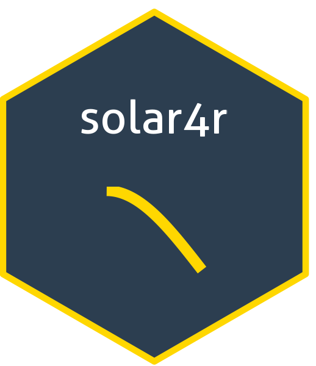
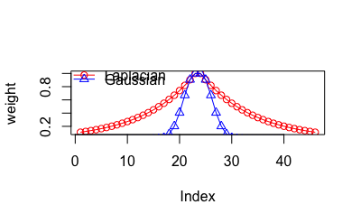
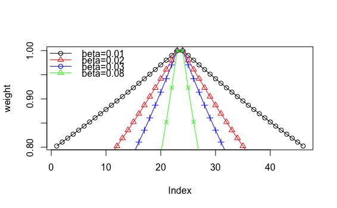

[](https://github.com/kpassadis/solar4r/actions/workflows/R-CMD-check.yaml)

# solar4r 

# solar4r: Solar Power Forecasting with SVR and Adaptive Conformal Prediction

`solar4r` is an R package designed for high-precision solar power forecasting. It bridges the gap between raw weather data and grid-ready power predictions by combining Support Vector Regression (SVR) with physically-aware feature engineering and statistical safety guarantees.

## Why solar4r?

### 1. The SVM Engine
While many modern frameworks default to deep learning, `solar4r` utilizes **Support Vector Regression (SVR)** as its primary engine. SVR provides an optimal "sweet spot" for solar energy applications:

- **Predictive Quality:** It yields highly accurate predictions even with smaller or noisier datasets where deep learning might overfit.
- **Ease of Use:** Fewer hyperparameters to tune compared to neural networks. Feature scaling is handled automatically by the underlying engine.
- **Explainability:** The geometric nature of the RBF/Laplacian kernel allows for a clearer understanding of how weather features interact with solar geometry.
- **Robustness:** Built on the well-established `e1071` (libsvm) library, it is efficient at handling non-linear data and can be used for both regression and outlier detection.

> **Sidenote on Scalability:** SVM complexity is typically $O(N^2)$ to $O(N^3)$ due to the SMO (Sequential Minimal Optimization) algorithm. While not suited for "Big Data" (millions of rows), `solar4r` is optimized for plant-level datasets where precision and stability are paramount.

### 2. Specialized Feature Engineering
The package provides a streamlined API for creating features that respect the physical reality of solar production:

- **Cyclic Components:** Projects time-of-day onto a circular coordinate system ($q_{sin}$, $q_{cos}$) to handle periodic boundaries.
- **Solar Geometry:** Built-in functions to calculate solar noon, daylight status, and distance-based importance.
- **Stratified Splitting:** Efficiently splits datasets into training, testing, and calibration sets while preserving the solar cycle's distribution.

### 3. Flexible Importance Weighting
A core innovation of `solar4r` is the introduction of **Importance Weights** (Laplacian or Gaussian), used for:

- **Strategic Sampling:** Pruning datasets to prioritize high-energy patterns over low-value nighttime noise.
- **Uncertainty Quantification:** Driving the adaptive logic of prediction intervals.

---

## Uncertainty via Adaptive Conformal Prediction

To ensure the model provides a reliable "safety net" for grid operators, we implement **Adaptive Conformal Prediction**. This method transforms a standard point forecast into a 90% confidence interval that expands and contracts based on the sun's intensity.

Instead of treating every historical error as equally important, we use **Solar-Noon Weighting**. The process involves:

1. **Standardize:** We convert raw MW errors into "Relative Scores" ($s_i$) by dividing the residual by the expected local uncertainty ($\sigma_i$):
   $$s_i = \frac{|y_i - \hat{y}_i|}{\sigma_i}, \quad \text{where} \quad \sigma_i = \frac{\hat{y}_i}{\text{Capacity}} + 0.05$$
2. **Order by Difficulty:** Scores are sorted from lowest to highest.
3. **Align Weights:** Importance weights (based on distance from solar noon) are reordered to match the sorted scores.
4. **Find the 90% Mass:** We calculate the Cumulative Sum of these weights and stop at the first score where we have accounted for 90% of the total weight mass. This threshold becomes our multiplier, $\hat{q}$.

The weights are calculated by computing the distance of each timestamp from solar noon. A decay function (Laplacian or Gaussian) is applied, controlled by the parameter $\beta$. (Typically, values around 0.01 provide a stable, broad focus around peak hours).

<p align="center">
  
</p>

<p align="center">
  
</p>

---

## Typical Workflow

The high-level R6 API provides a clean, professional workflow:

```r
# 1. Initialize the model
# Capacity is in MW, period is in minutes
model <- SolarModel$new(lat = 37.9838, lon = 23.7275, capacity = 2600, period = 15)

# 2. Prepare and split data
df_list <- model$prepare_data(solar, "tstamp", method = "gaussian")

# 3. Fit with parallel grid search
results <- model$fit(df_list$train, df_list$test, pv ~ temp + irrad * clds, parallel = TRUE)

# 4. Generate predictions with intervals
preds <- model$predict(df_list$test)

```

## Hyperparameter Interpretation: The Physics of SVM

In `solar4r`, hyperparameters reflect atmospheric conditions. When training on a 2600MW plant:

- Irradiance Only: Tuning often yields Low Cost (0.5) and Low γ (0.5). The model creates a smooth, simple curve to handle high variance.

- Full Weather Suite (Temp + Clouds): Parameters often shift to Cost = 32 and γ=0.707.

The Interpretation: By including temperature and cloud cover, the SVM recognizes that previous "noise" was actually panel degradation from heat or diffuse light. The model responds by adopting a stricter, tighter fit (High Cost) and a stable radius (γ) to map the weather-to-power relationship with much higher confidence.

## Running the software using a docker container

It is possible to use the solar4r library as a standalone application using Docker. This ensures all dependencies (R, e1071, etc.) are correctly configured without manual setup. Follow these steps to build and run the model:

1. Build the docker image

Navigate to the root directory of the project (where the Dockerfile is located) and run the following command to build the image:

```bash
docker build -t solar4r .
```

2.Prepare Your Data and Config

Ensure you have your input data (e.g., input_data.csv) and your config.json in a local directory. Since Docker containers have isolated file systems, we will "mount" your local folder so the container can read and write files.

3.Run the Model (Training Mode)

To train a new model, use the following command. This example mounts your current directory ($(pwd)) to the /app/data folder inside the container:

```bash
docker run -v $(pwd):/app/data solar4r \
  --mode train \
  --inFile /app/data/input_data.csv \
  --modelFile /app/data/solar_model.rds \
  --outFile /app/data/training_report.json
```

4.Run the Model (Evaluation Mode)

Once you have a saved .rds file, you can generate predictions on new data without re-training:

```bash
docker run -v $(pwd):/app/data solar4r \
  --mode eval \
  --modelFile /app/data/solar_model.rds \
  --inFile /app/data/new_weather_data.csv \
  --outFile /app/data/predictions.json
```

Command Line Arguments

You can override any setting in your config.json by passing flags directly to the docker command:

    -c, --config: Path to your JSON config file (default: config.json).

    --mode: Operation mode (train or eval).

    --inFile: The CSV file containing weather and production data.

    --outFile: The destination for the results (JSON format).

    --modelFile: The path to save or load the trained SVM model.

    --cap: Nominal capacity of the plant in MW.

    --formula: The R-style model formula (e.g., "production ~ temp + irrad").